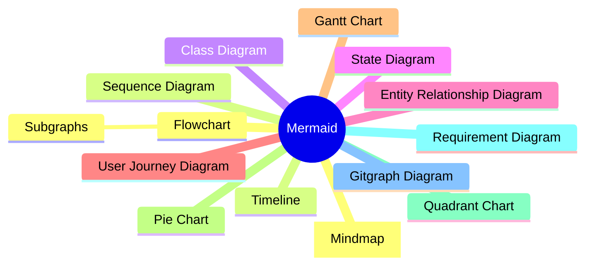
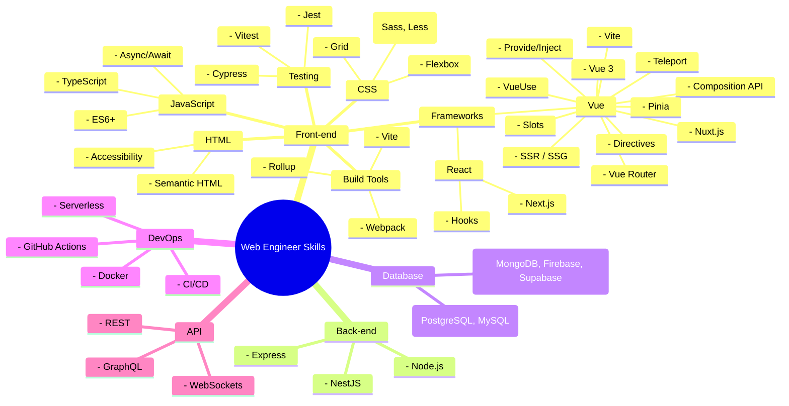

## Introduction



Recently, I explored using Mermaid to quickly generate diagrams. It's a convenient tool that supports various types of diagrams, such as flowcharts, mind maps, pie charts, etc. You can find support for [basically any diagram](https://mermaid.js.org/syntax/flowchart.html) you can think of. Here, I will briefly record the reasons for choosing this technology and my experiences using it.

## Why You Need to Use Mermaid

- **Freedom**: Open-source and free, avoiding vendor lock-in.
- **Speed**: Diagrams can be generated through text without the need for specific software.
- **Simplicity**: Using plain text to generate diagrams allows for high communication efficiency at low cost in the AI era. Also more friendly for multilingual website diagram generation.
- **Wide Adoption**: Supported by [major platforms](https://mermaid.js.org/ecosystem/integrations-community.html#productivity-tools), such as Notion, GitHub, Jira, etc.

## Why You Might Not Need to Use Mermaid

- **Too Rigid**: Unlike professional design software, it cannot achieve highly customized diagrams.
- **Additional Complexity**: Different types of diagrams require learning different syntax to express.

## How to Get Started with Mermaid in the AI Era

I won't go into detail about how to implement specific syntax, as the [official documentation](https://mermaid.js.org/syntax/flowchart.html) already explains it clearly. You can look up the corresponding syntax based on the type of diagram you are interested in.

I believe **most people do not want to spend too much time creating diagrams**, so I recommend familiarizing yourself with the **basic examples (Sample Diagrams)** in the [official online Mermaid editor](https://mermaid-js.github.io/mermaid-live-editor/) to see what types of diagrams are available, and then adjust according to your needs.

First, find the type of diagram you want, and then input it into AI, for example:

```
1. Help me use Mermaid to generate the necessary skills tree for web engineers using the form of Mindmap. Each node only describes related technologies or concepts.
2. Help me generate more concepts under the Vue node.
3. ...
```



<Info type="warning">

Encountering an error?

```
Error: Error: Parse error on line 66:
...節點gRPC) 子節點(WebSocket) 子節點
----------------------^
Expecting 'SPACELINE', 'NL', 'EOF', got 'NODE_ID'
```

Sometimes AI may ignore Mermaid's syntax. You can dynamically interact with AI based on the error messages to adjust, such as: `Help me remove () and the text of 'xxx'`. This will help produce a reasonably expected diagram. Alternatively, you can also provide more precise prompts!

</Info>

## Conclusion

Since Mermaid is a mature and widely used tool, AI generally has a high accuracy rate in generating corresponding diagrams. In the AI era, it is a good choice for quickly obtaining information and improving communication efficiency. The perfect combination of Mermaid and AI eliminates complexity, allowing us to focus more on content rather than spending too much time on diagram creation.
