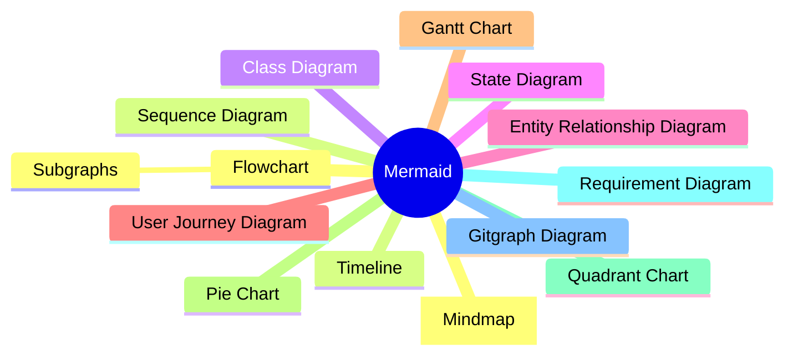
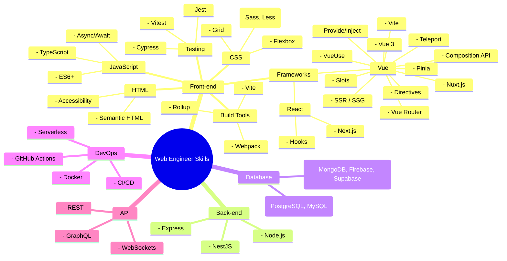

## 前言



近期工作中研究到使用 Mermaid 来快速生成图表，这是一款方便的工具，支持多种图表类型，例如流程图、心智图、圆饼图……等，你[能想到的图表](https://mermaid.js.org/syntax/flowchart.html)基本都有支持。大致记录一下选择这项技术的原因以及使用上的心得。

## 为什么你需要使用 Mermaid

- **自由**：开源免费，避免供应商锁定。
- **快速**：只需要通过文字就能生成图表，不需要通过特定软件设计。
- **简单**：使用纯文字生成图表，在 AI 时代可以用低成本传输高沟通效率的图表，对于多语系网站图表生成也更友好。
- **广泛**：[各大网站](https://mermaid.js.org/ecosystem/integrations-community.html#productivity-tools)皆支持，例如：Notion、GitHub、Jira……等。

## 为什么你不需要使用 Mermaid

- **制式化**：不像专业设计软件，无法做到高度定制化图表。
- **额外的复杂度**：针对不同的图表类型，需要学习不同的文字语法来表达。

## AI 时代如何上手 Mermaid

我并不会细说具体个别语法应该如何实践，因为论细节[官方文件](https://mermaid.js.org/syntax/flowchart.html)已经写得很清楚了，可以根据感兴趣的图表类型去查询对应的语法。

我相信**大多数人制作图表也不希望花太多时间在上面**，所以我会建议可以通过 [官方线上 Mermaid 编辑器](https://mermaid-js.github.io/mermaid-live-editor/) 的**基础范例(Sample Diagrams)熟悉有哪些图表类型**，然后再根据自己的需求去调整。

首先找到你想要的图表类型，然后丢到 AI 当中，举例：

```
1. 幫我用 Mermaid 生成網頁工程師必備技能樹使用 Mindmap 的形式，每個節點只描述相關技術或概念
2. 幫我在 Vue 節點下生成更多這項技術延伸的概念
3. ...
```



<Info type="warning">

遇到错误？

```
Error: Error: Parse error on line 66:
...節點gRPC) 子節點(WebSocket) 子節點
----------------------^
Expecting 'SPACELINE', 'NL', 'EOF', got 'NODE_ID'
```

有时候 AI 会忽视 Mermaid 的语法，可以动态地根据错误信息和 AI 互动调整，像是：`帮我去除 () 和子节点文字`。以生成合理期望的图表。或者你能列出更严谨精准的提示词也行！

</Info>

## 总结

因为 Mermaid 是一款成熟且广泛使用的工具，因此 AI 普遍对于生成对应的图表有很高的准确度，对于 AI 时代快速获取信息，提高沟通效率是一个不错的选择。Mermaid 与 AI 结合完美的免去了复杂度，让我们能够更专注在内容上，而不是花太多时间在制作图表上。
