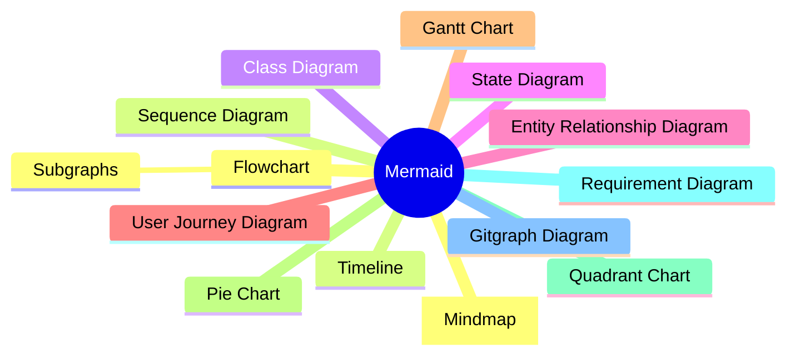
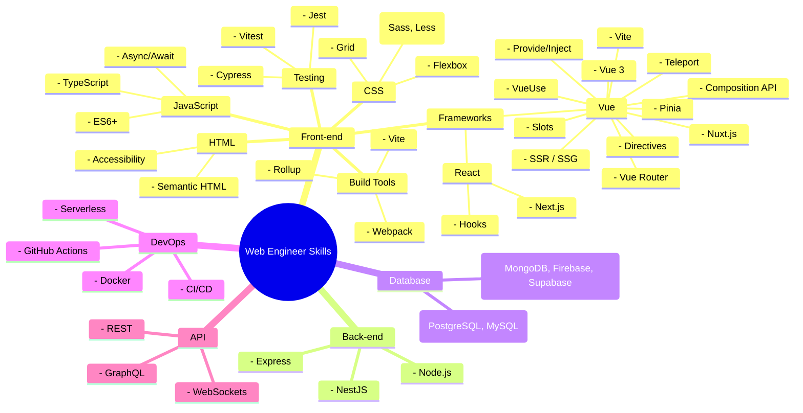

## 前言



近期工作順代研究到使用 Mermaid 來快速生成圖表，這是一個很方便的工具，可以快速生成各種圖表，例如流程圖、心智圖、圓餅圖……等，你[能想到的圖表](https://mermaid.js.org/syntax/flowchart.html)基本都有支援。大致紀錄一下選擇這項技術的原因以及使用上的心得。

## 為什麼你需要使用 Mermaid

- **自由**：開源免費，迴避供應商鎖定。
- **快速**：只需要透過文字就能生成圖表，不需要透過特定軟體設計。
- **簡單**：使用純文字生成圖表，在 AI 時代可以用低成本傳輸高溝通效率的圖表，對於多語系網站圖表生成也更友善。
- **廣泛**：[各大網站](https://mermaid.js.org/ecosystem/integrations-community.html#productivity-tools)皆支援，例如：Notion、GitHub、Jira……等。

## 為什麼你不需要使用 Mermaid

- **制式化**：不像專業設計軟體，無法做到高度客製化圖表。
- **額外的複雜度**：針對不同的圖表類型，需要學習不同的文字語法來表達。

## AI 時代如何上手 Mermaid

我並不會細說具體個別語法應該如何實踐，因為論細節[官方文件](https://mermaid.js.org/syntax/flowchart.html)已經寫得很清楚了，可以根據感興趣的圖表類型去查詢對應的語法。

我相信**大多人製作圖表也不希望花太多時間在上面**，所以我會建議可以透過 [官方線上 Mermaid 編輯器](https://mermaid-js.github.io/mermaid-live-editor/) 的**基礎範例(Sample Diagrams)熟悉有哪些圖表類型**，然後再根據自己的需求去調整。

首先找到你想要的圖表類型，然後丟到 AI 當中，舉例：

```
1. 幫我用 Mermaid 生成網頁工程師必備技能樹使用 Mindmap 的形式，每個節點只描述相關技術或概念
2. 幫我在 Vue 節點下生成更多這項技術延伸的概念
3. ...
```



<Sidenote type="warning">

有時候 AI 會無視 Mermaid 的語法，可以動態的根據錯誤訊息和 AI 互動調整，像是：`幫我去除 () 和子節點文字`。 以生出合理期望的圖表。或是你能列出更嚴謹精準的提示詞也行！

</Sidenote>

## 總結

因為 Mermaid 是一款成熟且廣泛使用的工具，因此 AI 普遍對於生成對應的圖表有很高的準確度，對於 AI 時代快速獲取資訊，提高溝通效率是一個不錯的選擇。Mermaid 與 AI 結合完美的免去了複雜度，讓我們能夠更專注在內容上，而不是花太多時間在製作圖表上。
